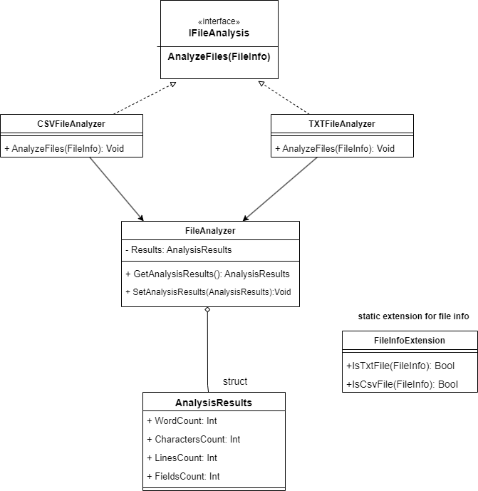

# FileAnalyzer

**FileAnalyzer** is a console application designed to analyze text files and CSV files within a specified directory. The program calculates and displays various metrics such as word count, character count, line count, and field count for CSV files. This tool is useful for quickly gathering information from text-based files.

## Features

- **Directory-Based File Analysis**: Users can specify a directory, and the program will analyze all `.txt` and `.csv` files within that directory.
  
- **File Type Identification**: The program automatically identifies and processes `.txt` and `.csv` files using custom extension methods.
  
- **Text File Analysis**:
  - **Word Count**: Counts the number of words in a text file.
  - **Character Count**: Counts the number of characters in a text file.
  - **Line Count**: Counts the number of lines in a text file.

- **CSV File Analysis**:
  - **Line Count**: Counts the number of lines (rows) in a CSV file.
  - **Field Count**: Counts the number of fields (columns) in the first row of a CSV file.

- **Modular Design**:
  - **FileAnalyzer**: A base class that handles storing analysis results.
  - **TXTFileAnalyzer**: A class that extends `FileAnalyzer` and implements `IFileAnalysis` for analyzing text files.
  - **CSVFileAnalyzer**: A class that extends `FileAnalyzer` and implements `IFileAnalysis` for analyzing CSV files.
  - **IFileAnalysis**: An interface that defines the `AnalyzeFiles` method for file analysis classes.
 
### Technologies

- **Programming Language**: C#
- **Development Environment**: Visual Studio
## UML Diagram

## Getting Started

### Prerequisites

- **.NET SDK**: Make sure you have the .NET SDK installed on your machine.
